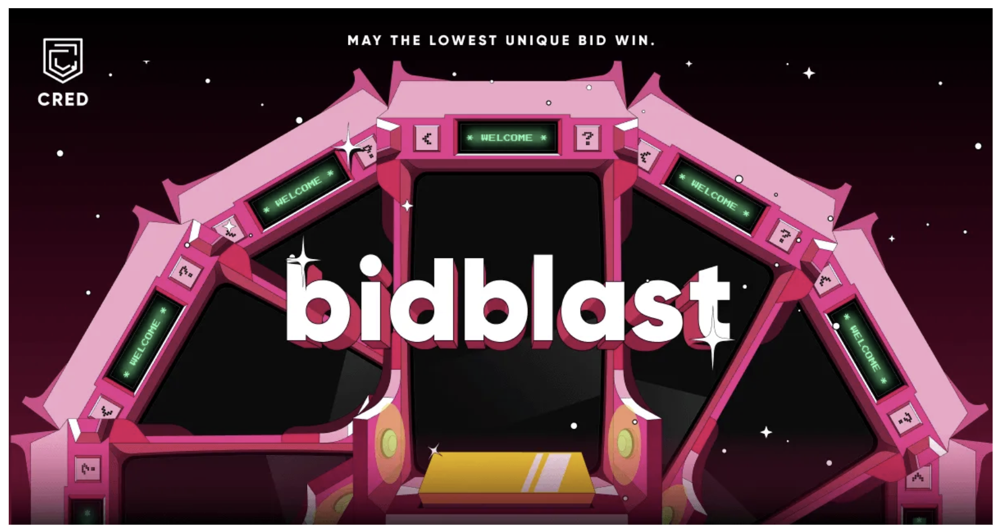

# Design Bidblast

## Intro

Watch https://youtu.be/gRqeedW-UTU
Or
[Read How To Play CRED Bid Blast - Rupee Magnet](https://rupeemagnet.com/how-to-play-cred-bid-blast/)



## Requirements Gathering

What are some top 10 questions you would ask to gather requirements but don't worry too much if they're exactly right? Just write down whatever ideas you have. The goal here is to get better at understanding what your system needs and what it should be able to do.
Add them below.

```


‎
```

<details>
<summary>Reveal Solution</summary>

1. How many sets at max can I buy for a particular event?

- 5

2. Is the price the same for all the sets?

- First set - 100 coins
- Second set - 500 coins
- Third set - 1000 coins
- Fourth set - 1500 coins
- Fifth set- 2000 coins

3. How many bids can a set contain?

- 6

4. How many lavish item can a particular event display?

- Only one

5. How is the winner decided?

- Member who places the lowest unique bid.

6. What to do if there is no lowest unique bid among bids?

- Declare winner who has the lowest bid and submitted the set the earliest.
- For eg:-
- If 78 is the lowest bid and there are 3 members who had this amount in their bidset.
- Member with 78 who submitted the bidset the earliest out of them will be winner.

</details>

## Requirements

System can

- Add a new event with a winning item
- Declare winner of a bidding event

Members can

- Participate in a event for a particular item
- Buy set of bids using cred coins
- Submit a set
- See latest winners of past events

## RACE

Follow the RACE Template and come up with the required **APIs** and **Classes** for the above detailed requirements.

### APIs

> What will be some APIs that you would design for this system? Come up with use cases from the requirements and try to design APIs for each of them.

```


‎

```

### Classes

> What do you think are the entities along with attributes & their relationships that will be required here? Add them below.

```


‎
```
