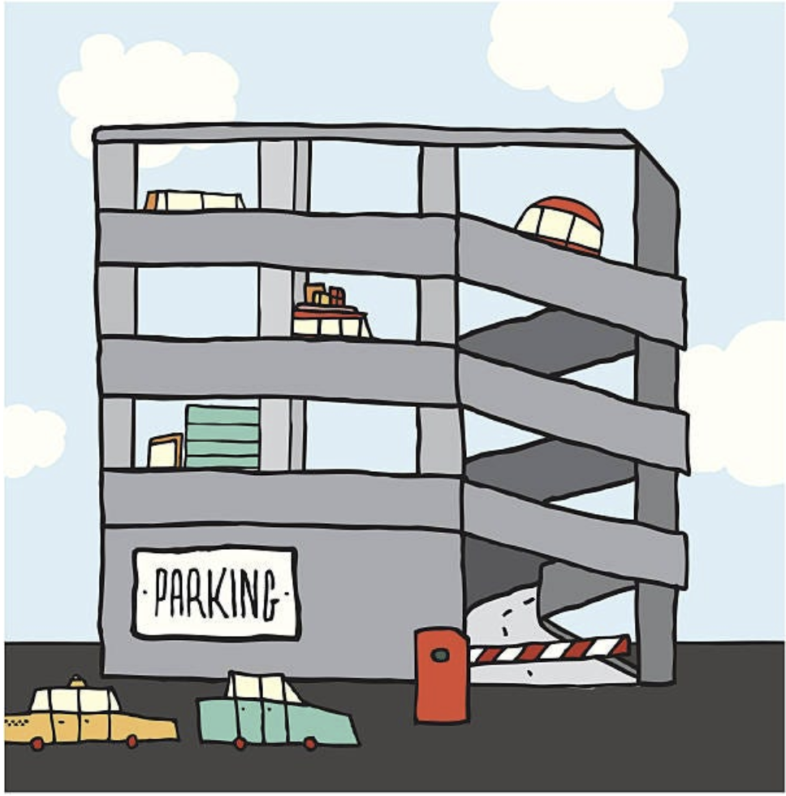

b# Design Parking Lot

## Intro

A parking lot is a designated area for vehicles to park temporarily. It serves as a crucial element in urban planning and transportation management.



Here are some key points about parking lots:

A parking lot is an open or enclosed area where vehicles can be parked when not in use.

**Types:** There are various types of parking lots, including surface lots, parking garages (multilevel or underground), and dedicated parking structures.

**Locations:** Parking lots can be found in various settings, such as commercial areas, residential neighborhoods, airports, shopping centers, and office complexes.

**Payment:** Some parking lots charge fees for vehicle parking, while others may offer free parking.

**Future Trends:** Emerging technologies like automated parking systems and smart parking apps are changing how parking lots are operated and accessed. We will design a parking a lot which can cater to this future trends.

## Requirements Gathering

What are some top 10 questions you would ask to gather requirements but don't worry too much if they're exactly right? Just write down whatever ideas you have. The goal here is to get better at understanding what your system needs and what it should be able to do.
Add them below.

```
1. What is the primary purpose of the parking lot system (e.g., efficiency, user convenience, or revenue generation)?

2. Who are the target users of the system (e.g., employees, visitors, residents), and do they have different access levels?

3. What types of vehicles will the parking lot accommodate (e.g., cars, motorcycles, EVs)?

4. Will the system require a payment mechanism, and if so, which methods should it support (e.g., cash, cards, mobile payments)?

5. Should the system offer real-time parking space availability and reservation features?

6. Are there requirements for integrating the system with mobile apps, public transportation, or other platforms?

7. What security features are needed (e.g., cameras, license plate recognition, barriers)?

8. Will the parking lot need EV charging stations, and if so, how many and what types?

9. Are there any reporting or analytics requirements (e.g., daily usage, revenue reports, or occupancy rates)?

10. What specific sustainability or environmental considerations should the system address (e.g., solar panels, green building compliance)?
‎
```

<details>
<summary>Reveal Solution</summary>
  
1. Can a parking lot have multiple floors?
2. Can a parking lot have multiple entrances?
3. Can a parking lot have multiple exits?
4. Can a parking lot have multiple types of vehicles?
5. How will a vehicle be parked? Can we park any type of vehicle in any slot?
6. How do we know if a slot is empty? What if the parking lot is full?
7. How are we allocated a slot?
8. How will the vehicle be unparked? How do we get a ticket?
9. How will charges be calculated? What are the different pricing strategies we want to support?
10. How can a user pay?
</details>

## Requirements

Below are the finalized requirements approved by the interviewer:

1. Can a parking lot have multiple floors?
   - Yes, parking lots can have multiple floors or levels to accommodate more vehicles in limited space.
2. Can a parking lot have multiple entrances?

   - Yes, parking lots often have multiple entrances to facilitate access from different directions or roads.

3. Can a parking lot have multiple exits?

   - Yes, parking lots typically have multiple exits to allow vehicles to leave from various points within the lot.

4. Can a parking lot have multiple types of vehicles?

   - Yes, parking lots can accommodate multiple types of vehicles, such as cars, motorcycles, and trucks. The parking spaces and layout may be designed to accommodate different vehicle sizes.

5. How will a vehicle be parked? Can we park any type of vehicle in any slot?

   - Vehicle approaches the entry gate. System allocates an appropriate parking spot and provides a parking ticket to the driver.
   - The parking lot will have designated parking spaces for different types of vehicles like cars, motorcycles, bicycles, and other larger vehicles.
   - You cannot park any type of vehicle in any slot; it should be parked in a space appropriate for its size and type.

6. How do we know if a slot is empty? What if the parking lot is full?

   - Empty slots can be known through real-time slot availability by the system.
   - If the parking lot is full, vehicles may need to wait until a slot becomes available or be directed to an overflow area if available.

7. How are we allocated a slot?

System may support various ways of slot allocation and can be configured to use accordingly.

- First Come First Serve (FCFS) Allocation: The first available parking spot is allocated.
- Nearest Entry Allocation: Allocate the nearest parking spot to the entry/exit to minimize walking distance.

8. How will the vehicle be unparked? How do we get a ticket?
   - Vehicle approaches the exit gate and driver provides the parking ticket to the dispenser.
   - System calculates parking charges based on the time duration.
   - Driver makes the payment and Gate opens to allow vehicle exit.
9. How will charges be calculated? What are the different pricing strategies we want to support?

   - Charges can be calculated based on factors like the duration of parking, vehicle type, and parking rate. But for now, we'll try to keep it simple:-
   - Flat Rate Pricing: A fixed rate regardless of the duration for each vehicle type.
     - CAR:- 200
     - MOTORCYCLE:- 100
     - BICYCLE:- 50
     - LARGE:- 500

10. How can a user pay?
    - Cash payment at kiosks.
    - Credit/debit card payment at kiosks.
    - Mobile apps that allow users to pay digitally through UPI.
    - Prepaid parking cards or passes for frequent users.

## RACE

Follow the RACE Template and come up with the required **APIs** and **Classes** for the above detailed requirements.

### APIs

> What will be some APIs that you would design for this system? Come up with use cases from the requirements and try to design APIs for each of them.

---

<br/>

1. Parking Lot Configuration and Setup
   `POST: /configure-lot`

```json
//body
{
  "floors": 3,
  "entrances": 2,
  "exists": 2,
  "vehicleTypes": ["car", "motorcycle", "bicycle", "large"]
}
//response
{
  "message": "Parking lot configured successfully",
  "lotId": "12345"
}
```

2.Check Slot Availability
`GET: /slots/availability`

```json
/*
query params
- vehicleType
- floor(optional)
*/

//response
{
  "availableSlots": 30,
  "totalSlots": 50
}
```

3. Allocate a Parking Slot
   `POST: /slots/allocate`

```json
//body
{
   "vehicleType": "car",
   "entryGate": "north"
}

//response
{
   "ticketId": "T12345",
   "allocatedSlots": "2A-15",
   "message": "slot aloocated successfully"
}
```

4. Release a parking slot
   `POST: /slots/release`

```json
//body
{
   "ticketId": "T12345",
}

//response
{
   "slotId": "2A-15",
   "charges": 200,
   "message": "slot released successfully"
}
```

5. Calculate Charge
   `GET: /charges/calculate`

```json
/*
query params
- ticketId
*/

//response
{
  "charges": 200,
  "durationHr": 2,
  "vehicleType": "car"
}
```

6. Process Payment
   `POST /payments`

```json
//body
{
   "ticketId": "T12345",
   "paymentUrl": "https://etc.payments/paymentId?user=sdfsdf",
   "amount": 200,
}

//response
{
   "message": "Payment successful",
   "transactionId": "IXAT123",
}
```

7. Get Parking History
   `GET: /history`

```json
/*
Query Params
- ticketId(Optional)
- userId(Optional)
*/

//response
[
  {
    "ticketId": "T12345",
    "entryTime": "2024-12-05T10:00:00",
    "exitTime": "2024-12-05T12:00:00",
    "charges": 200
  }
]
```

8. User payment wallet
   `GET: /wallet/balance`

```json
/* Query Params
- userId
*/

{
  "balance": 500
}
```

`POST: /wallet/top-up`

```json
//body
{
   "userId": "U12345",
   "amount": 200
}

//response
{
   "message": "wallet topedup successfully",
   "previousBalance": 0,
   "balance": 200,
}
```

9. System Monitoring
   `GET: /system/status`

```json
//response
/*
Query Params
- floor(optional)

*/
{
  "floors": [
    {
      "floorNumber": 1,
      "availableSlots": 10,
      "totalSlots": 50
    },
    {
      "floorNumber": 2,
      "availableSlots": 5,
      "totalSlots": 40
    }
  ]
}
```

## <br/>

### Classes

> What do you think are the entities along with attributes & their relationships that will be required here? Add them below.

1. `ParkingLot`
   Represents the entire parking lot.

   Attributes:
   `id`: Unique identifier for the parking lot.
   `name`: Name of the parking lot.
   `floors`: List of Floor entities.
   `totalCapacity`: Total parking capacity.
   `location`: Geographical location of the parking lot.

   - Relationships: Has multiple Floor entities.
     <br/>

2. `Floor`
   Represents a specific floor in the parking lot.

   Attributes:
   `id`: Unique identifier for the floor.
   `floorNumber`: Number of the floor.
   `totalSlots`: Total number of slots on this floor.
   `availableSlots`: Count of currently available slots.

   - Relationships: Has multiple Slot entities.
     <br/>

3. `Slot`
   Represents an individual parking slot.

   Attributes:
   `id`: Unique identifier for the slot.
   `slotNumber`: Unique number within the floor.
   `vehicleType`: The type of vehicle the slot is designated for (e.g., car, motorcycle).
   `isOccupied`: Boolean indicating if the slot is occupied.

   - Relationships:Belongs to one Floor. May be occupied by a Vehicle.
     <br/>

4. `Vehicle`
   Represents a parked or parking vehicle.

   Attributes:
   `id`: Unique identifier for the vehicle.
   `licensePlate`: License plate number.
   `type`: Type of vehicle (e.g., car, motorcycle).

   - Relationships: May occupy a Slot.
     <br/>

5. `Ticket`
   Represents the ticket issued for a vehicle.

   Attributes:
   `id`: Unique identifier for the ticket.
   `vehicleId`: Identifier for the associated vehicle.
   `entryTime`: Timestamp of vehicle entry.
   `exitTime`: Timestamp of vehicle exit (nullable if still parked).
   `allocatedSlotId`: The ID of the allocated slot.
   `charges`: Total parking charges (nullable if still parked).

   - Relationships: Associated with one Vehicle.
     <br/>

6. `Payment`
   Represents a payment transaction.

   Attributes:
   `id`: Unique identifier for the payment.
   `ticketId`: Identifier for the associated ticket.
   `amount`: Amount paid.
   `paymentMethod`: Method used (e.g., cash, credit card).
   `transactionTime`: Timestamp of the transaction.

   - Relationships: Associated with one Ticket.
     <br/>

7. `User`
   Represents frequent users or those with accounts.

   Attributes:
   `id`: Unique identifier for the user.
   `name`: User's name.
   `email`: User's email address.
   `phoneNumber`: User's contact number.
   `walletBalance`: Prepaid balance for frequent users.

   - Relationships: May have multiple Ticket entities.
     <br/>
