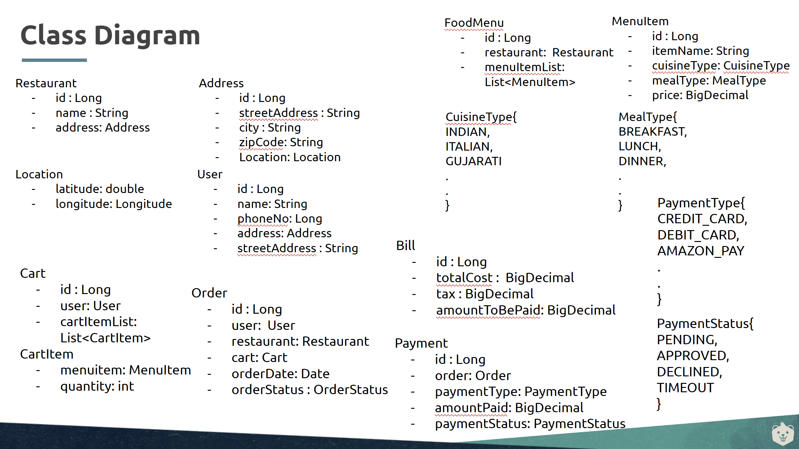

# Design Swiggy

## Class Diagram till now

This is the intermediate class diagram for the requirements that we have addressed so far.



## Requirements

Below are the additional requirements shared by the interviewer:

Users can

- Apply the coupons for discounts during payment.
- Rate and review restaurants and dishes.
- Save multiple delivery addresses.

Restaurants can

- register themselves and manage profile details.
- Set restaurant hours availability.
- Add, update the food menu, prices, descriptions and it’s availability, etc.

Delivery boy can

- Accept or decline delivery requests.
- Update delivery status ( e.g, out of delivery, Delivered )
- Access customer notes or special instructions for deliveries.
- Set availability status ( online/offline)

## RACE

Follow the RACE Template and come up with the required **APIs** and **Classes** for the above detailed requirements.

### APIs

> What will be some APIs that you would design for this system? Come up with use cases from the requirements and try to design APIs for each of them.

```

-----------
## Users ##
-----------

PaymentWithCoupons extends ApplyPayments
    -- calculateTotal(menuList: List<MenuItem>): BigDecimal
    -- applyCoupon(couponCode: String, actualAmt: BigDecimal): BigDecimal


RateAndReview extends ReviewSystem
    -- rateRestaurant(restaurantId: Long, rating: int): void
    -- reviewRestaurant(restaurantId: Long, review: String): void
    -- rateDish(menuItemId: Long, rating: int): void
    -- reviewDish(menuItemId: Long, review: String): void


AddressManager
    -- saveAddress(address: Address): void
    -- updateAddress(addressId: Long, updatedAddress: Address): void
    -- deleteAddress(addressId: Long): void
    -- getAllAddresses(userId: Long): List<Address>
    -- setPrimaryAddress(addressId: Long): boolean | address


------------------
## Restaurants ##
------------------

RestaurantRegistration extends ProfileManager
    -- registerRestaurant(restaurantDetails: Restaurant): Long
    -- updateProfile(restaurantId: Long, updatedDetails: Restaurant): void
    -- getProfile(restaurantId: Long): Restaurant


RestaurantAvailability extends HoursManager
    -- setHours(restaurantId: Long, hours: Map<DayOfWeek, String>): void
    -- updateAvailability(restaurantId: Long, isOpen: Boolean): void
    -- getAvailability(restaurantId: Long): Boolean


MenuManagement extends FoodMenuManager
    -- addMenuItem(restaurantId: Long, menuItem: MenuItem): Long
    -- updateMenuItem(menuItemId: Long, updatedDetails: MenuItem): void
    -- deleteMenuItem(menuItemId: Long): void
    -- updateItemAvailability(menuItemId: Long, isAvailable: Boolean): void
    -- getMenu(restaurantId: Long): List<MenuItem>


------------------
## DeliveryBoy ##
------------------

DeliveryRequestManager
    -- acceptRequest(orderId: Long): void
    -- declineRequest(orderId: Long): void
    -- getAssignedRequests(deliveryBoyId: Long): List<Order>

    -- getSpecialInstructions(orderId: Long): String
    -- updateDeliveryStatus(orderId: Long, status: DeliveryStatus): void

```

### Classes

> What do you think are the entities along with attributes & their relationships that will be required here? Add them below.

```

class User {
  id: Long
  name: String
  email: String
  phoneNo: Long
  addressList: List<Address> // One-to-Many
  orders: List<Order>        // One-to-Many
  reviews: List<Review>      // One-to-Many
  coupons: List<Coupon>      // One-to-Many
}


class Restaurant {
  id: Long
  name: String
  address: Address           // One-to-One
  isOpen: Boolean
  hoursOfOperation: Map<DayOfWeek, String>
  menuItems: List<MenuItem>  // One-to-Many
  reviews: List<Review>      // One-to-Many
  orders: List<Order>        // One-to-Many
}


class MenuItem {
  id: Long
  name: String
  cuisineType: CuisineType   // ENUM (e.g., INDIAN, ITALIAN)
  mealType: MealType         // ENUM (e.g., BREAKFAST, LUNCH)
  price: BigDecimal
  availability: Boolean
  restaurant: Restaurant     // Many-to-One
  reviews: List<Review>      // One-to-Many
  cartItems: List<CartItem>  // One-to-Many
}


class Order {
  id: Long
  user: User                 // Many-to-One
  restaurant: Restaurant     // Many-to-One
  cart: Cart                 // One-to-One
  payment: Payment           // One-to-One
  deliveryBoy: DeliveryBoy   // Many-to-One
  orderDate: Date
  specialInstructions: String
  orderStatus: OrderStatus   // ENUM (e.g., PENDING, COMPLETED)
  deliveryStatus: DeliveryStatus // ENUM (e.g., OUT_FOR_DELIVERY, DELIVERED)
}


class Cart {
  id: Long
  items: List<CartItem>      // One-to-Many
  order: Order               // One-to-One
}


class Payment {
  id: Long
  order: Order               // One-to-One
  paymentType: PaymentType   // ENUM (e.g., CREDIT_CARD, DEBIT_CARD)
  paymentStatus: PaymentStatus // ENUM (e.g., PENDING, APPROVED)
  amountPaid: BigDecimal
  coupon: Coupon             // Many-to-One
}


class Coupon {
  id: Long
  code: String
  discountPercentage: BigDecimal
  validTill: Date
  users: List<User>          // One-to-Many
  payments: List<Payment>    // One-to-Many
}


class Review {
  id: Long
  user: User                 // Many-to-One
  restaurant: Restaurant     // Many-to-One
  menuItem: MenuItem         // Many-to-One
  rating: int
  reviewText: String
  createdAt: Date
}


class DeliveryBoy {
  id: Long
  name: String
  phoneNo: Long
  orders: List<Order>        // One-to-Many
  availabilityStatus: DeliveryStatus // ENUM (e.g., ONLINE, OFFLINE)
}


class Address {
  id: Long
  streetAddress: String
  city: String
  zipCode: String
  location: Location         // One-to-One
  user: User                 // Many-to-One
  restaurant: Restaurant     // Many-to-One
}


class Location {
  latitude: Double
  longitude: Double
  address: Address           // One-to-One
}


‎
```
