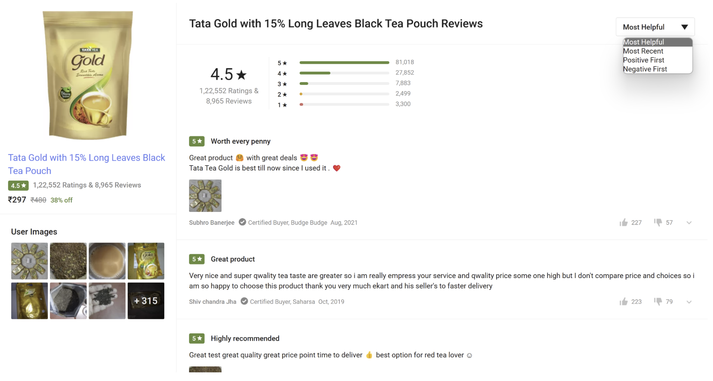

# Design Reviews & Rating System

## Intro

Visit [Flipkart.com](flipkart.com)
& Click on any Product and explore the Product reviews section



## Requirements

Below are the requirements shared by the interviewer:

User should be able to

- add review text & rating for the product
- Upvote/downvote reviews
- See the summary of ratings of a product
- Fetch reviews for a product based on
  - Most helpful
  - Most recent
  - Positive first
  - Negative first

## RACE

Follow the RACE Template and come up with the required **APIs** and **Classes** for the above detailed requirements.

### APIs

> What will be some APIs that you would design for this system? Come up with use cases from the requirements and try to design APIs for each of them.

```


‎

```

### Classes

> What do you think are the entities along with attributes & their relationships that will be required here? Add them below.

```


‎
```
